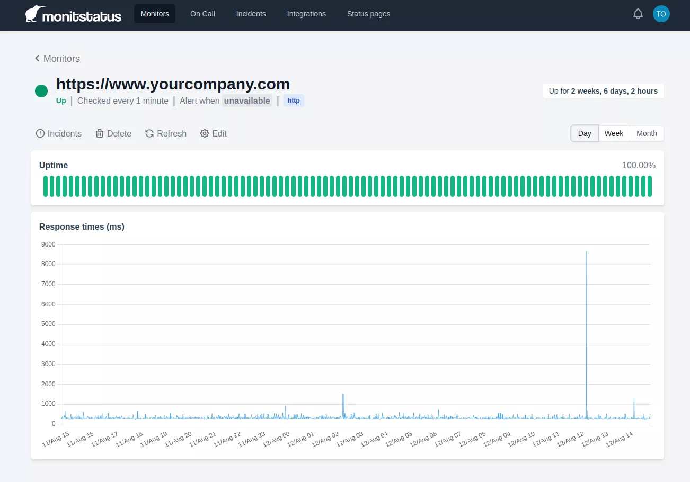

# Monitstatus 

**Monitstatus** is an all in one SRE observability and incident management suite.

## Features

### Uptime monitoring

Monitor your services with periodic checks. Use it for either webpage, API, servers or network services monitoring. Define your endpoint monitors as well as the expected response and get notified when an incident ocurrs.

### Incident alerts

Be the first to know when a downtime occurs. Receive notifications of an outage via our multiple integrations: Email, SMS, Telegram, Slack.. Analyze and manage the incident cause with our incident details.

### Status pages

Beautifully crafted, customized status pages. Communicate status and incident management with your users. Build trust with every incident.

### On call schedules

*Still a work in progress.*

## Quickstart

### Repositories

Source code is split between two repositories:

 * [front](https://github.com/monitstatus/front) contains the Vue client
 * [back](https://github.com/monitstatus/back) contains the API, celery beat/workers and status pages webapp

### Dependencies

 - SendGrid api key with a validated sending domain
 - (Optional) Slack App
 - (Optional) Telegram Bot
 - (Optional) Sentry DSN

### Running from docker images

Clone the repos, manually set the envvars for both repos and launch the local environment:

    git clone git@github.com:monitstatus/monitstatus.git
    cd monitstatus
    git submodule init
    git submodule update
    cp back/.env.sample back/.env
    # Edit .env file and set the required variables

    docker compose -f back/docker-compose.yml run --rm web alembic upgrade head 
    # This will create templates on sendgrid and print envvars that you should copy to .env file
    docker compose -f back/docker-compose.yml run --rm web python app/core/generate_sendgrid_templates.py
    docker compose -f back/docker-compose.yml up -d

    cd front
    # IMPORTANT! replace build arguments if required
    docker build \
        --build-arg FRONT_URL=http://localhost:8080
        --build-arg API_URL=http://localhost:8000 \
        --build-arg SLACK_CLIENT_ID=$SLACK_CLIENT_SECRET \
        --build-arg STATUS_PAGES_URL=http://localhost:8001 \
        -t front .
    docker run -d -p 127.0.0.1:8080:80 --name front front

And go to http://localhost:8080
